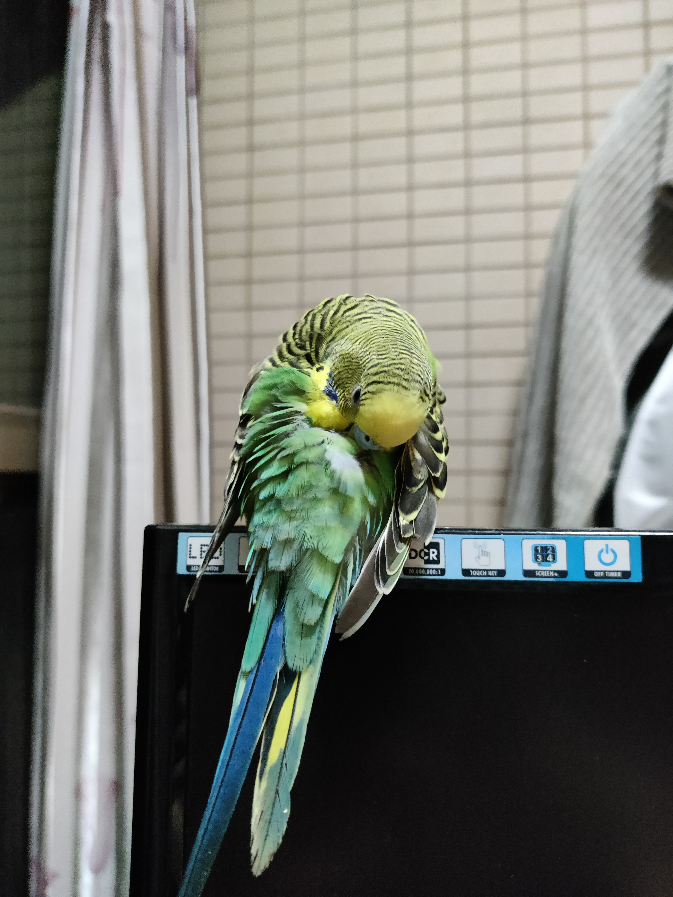
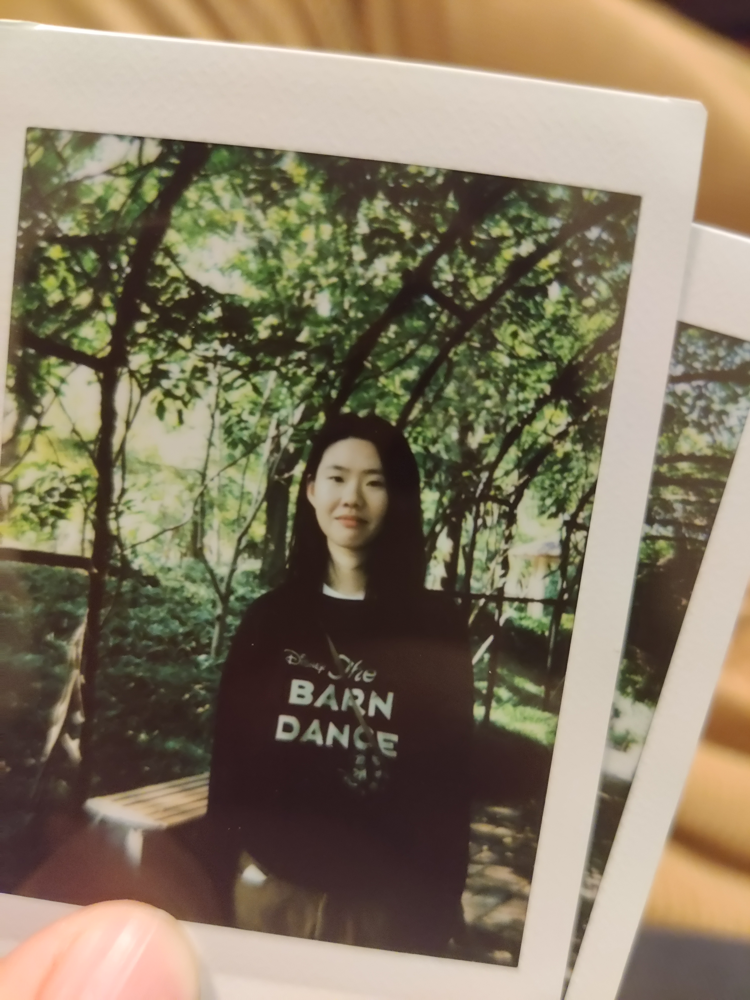

I hardly take photos though, in this digital world, I still have some photos to share with you in case you never meet me in person. 

Some of them are actually my training/validation data. I assure you these images are all natural images. 

I better start with a belle photo of my parrot. 

{: .responsive-img }

[My beautiful parrot posing for the camera

*My beautiful parrot posing for the camera*

{: width="50%" }

*Me at Shanghai Jiao Tong University*

T.B.C.
